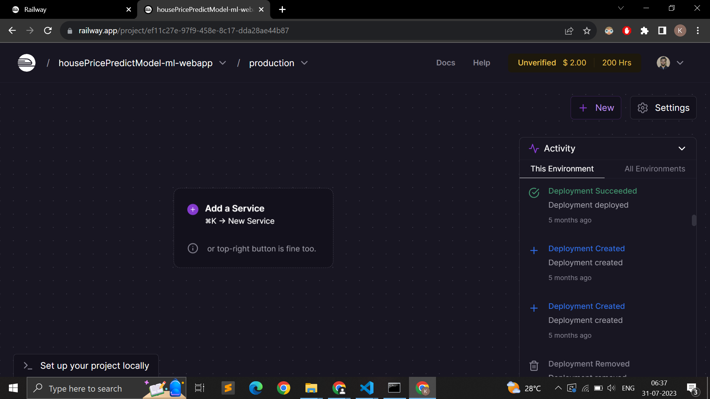
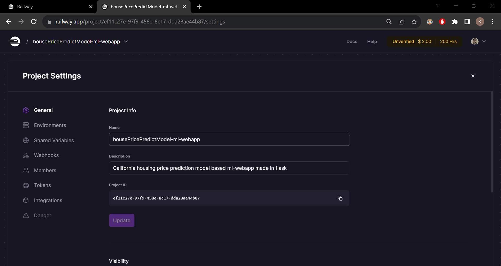
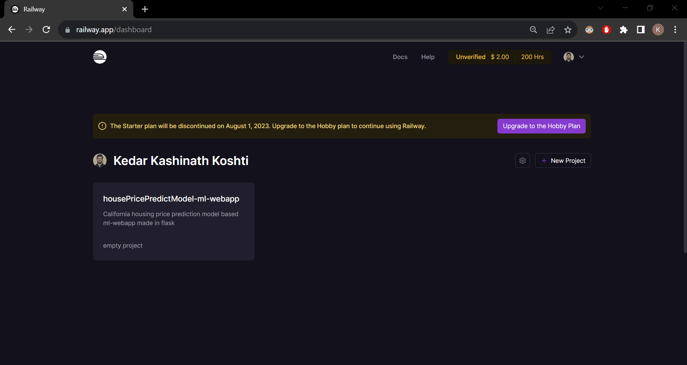
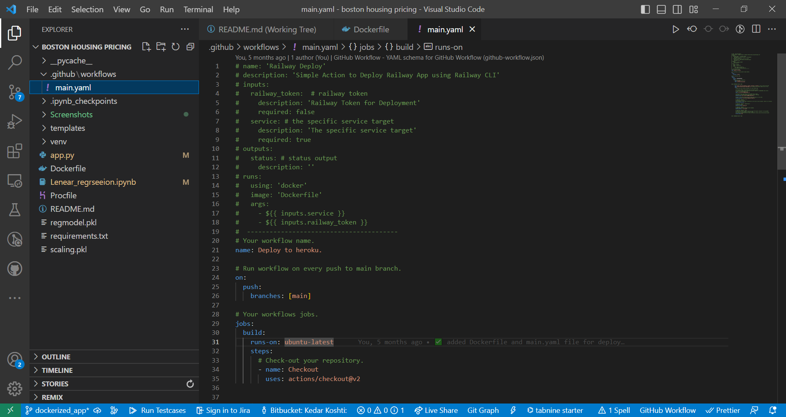
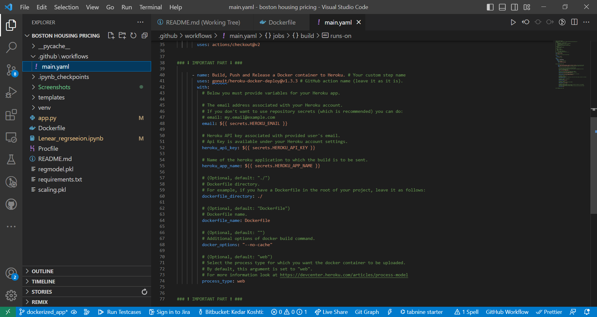
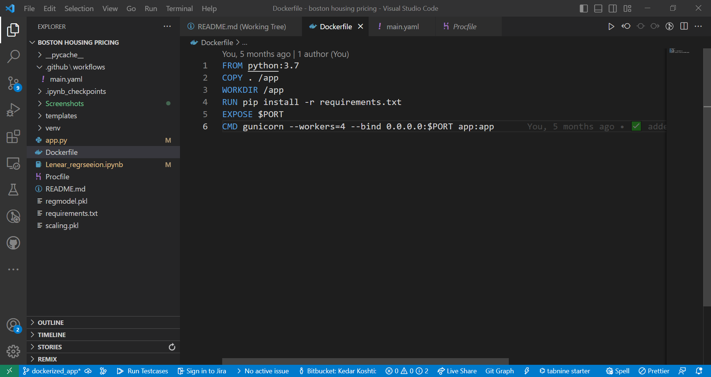
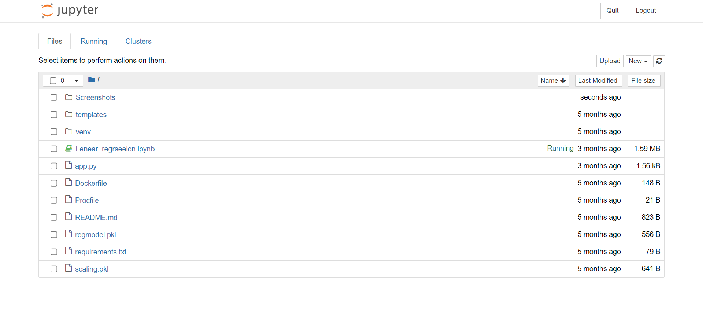

# California House Prediction Model

100% Working - Deployed & Tested (See more advanced Dockerized version on dockerized_app branch) 

Deployed Link - https://california-housing-price-prediction-model-ml-webapp.up.railway.app/

Steps -

```
venv\Scripts\Activate.bat
```

```
pip install -r requirements.txt
```

```
flask run
```

dummy json to api http://127.0.0.1:5000/predict_api-
{
"data": {
"MedInc": 8.3252,
"HouseAge": 52.0,
"AveRooms": 6.238137,
"AveBedrms": 1.081081,
"Population": 496.0,
"AveOccup": 2.547945,
"Latitude": 37.88,
"Longitude": -122.22
}
}
response - 85.75548629729107

Add

```
CI=false
```

in terminal build vars
in settings disable restart on error instead check don't restart option, connect this repo to the railways app thats it let it get built.

# Screenshots










Changed default branch from main to dockerized_app